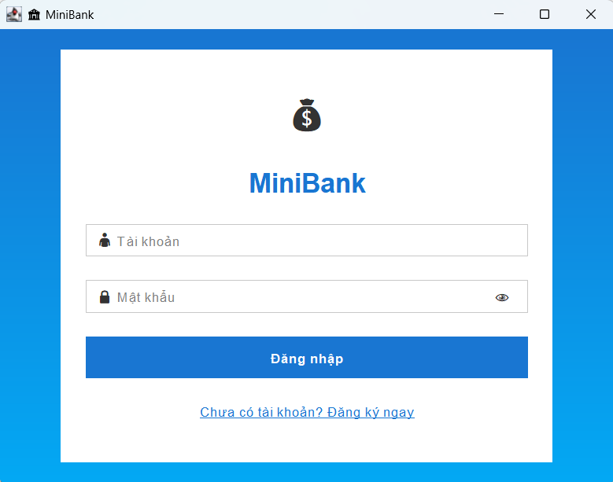
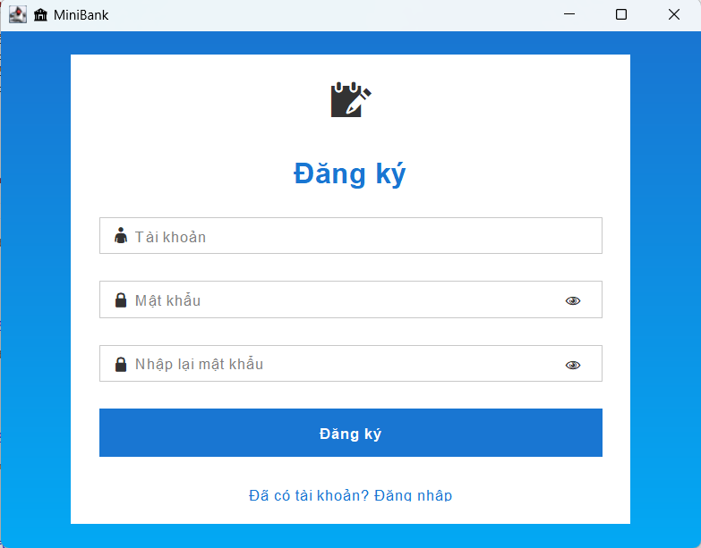
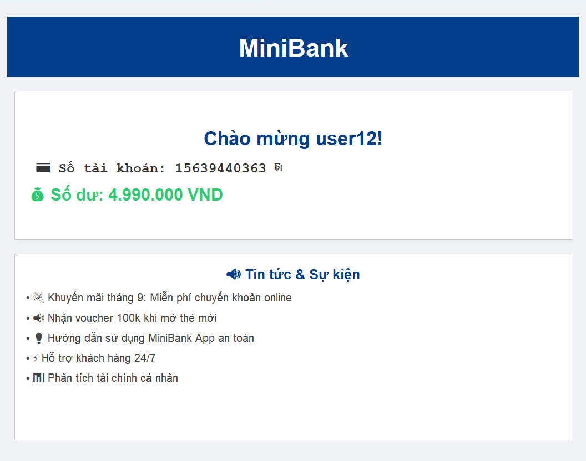
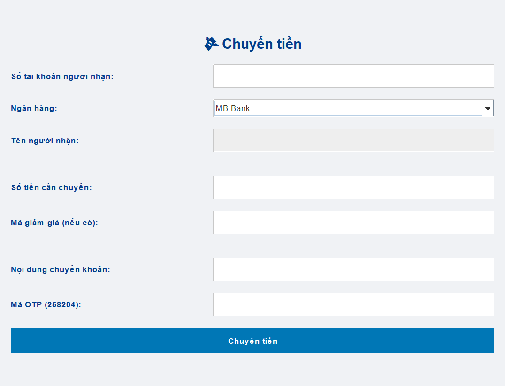
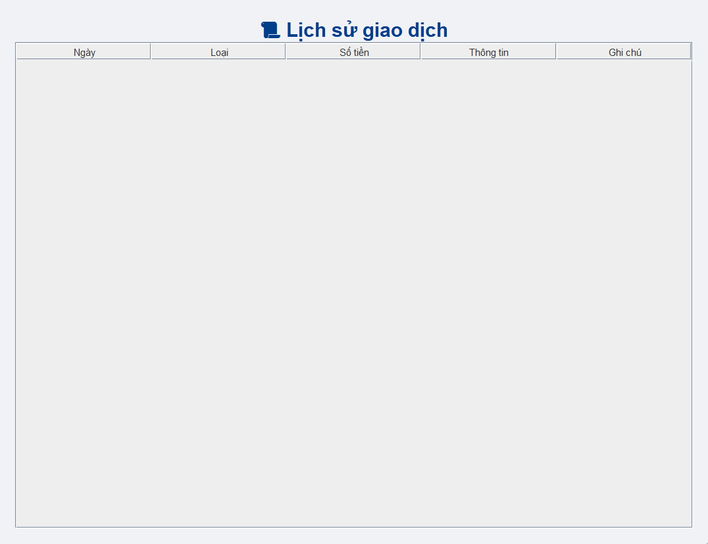
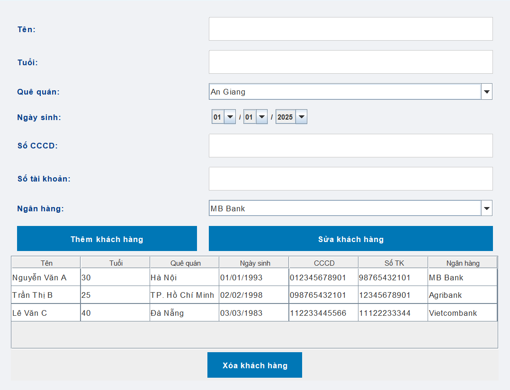

<h2 align="center">
    <a href="https://dainam.edu.vn/vi/khoa-cong-nghe-thong-tin">
    🎓 Faculty of Information Technology (DaiNam University)
    </a>
</h2>
<h2 align="center">
    HỆ THỐNG QUẢN LÝ NGÂN HÀNG MINI
</h2>
<div align="center">
    <p align="center">
        
        
        
    </p>

[](https://www.facebook.com/DNUAIoTLab)
[](https://dainam.edu.vn/vi/khoa-cong-nghe-thong-tin)
[](https://dainam.edu.vn)

</div>

---

## 1. Giới thiệu hệ thống
Hệ thống **MiniBank** gồm 2 tiến trình:  
- **Server**: xử lý nghiệp vụ tài khoản, giao dịch và phản hồi yêu cầu.  
- **Client**: ứng dụng giao diện **Java Swing** cho người dùng.  

Các chức năng chính:  
- Đăng nhập / Đăng ký tài khoản  
- Nạp tiền, Rút tiền, Chuyển khoản  
- Xem số dư, Lịch sử giao dịch, Đổi mật khẩu  
- Đăng xuất, kết thúc phiên  

Kết nối **Client ↔ Server** qua **TCP Socket** với giao thức chuỗi lệnh (`LOGIN`, `SIGNUP`, `XEM`, `GUI`, `RUT`, `CHUYEN`, `HISTORY`, `LOGOUT`).  

---

## 2. Ngôn ngữ & Công nghệ sử dụng
<div align="center">

[](https://www.oracle.com/java/)
[]()
[]()
[]()

</div>

---

## 3. Hình ảnh các chức năng

<p align="center">
  <br/>
  <em>Hình 1. Giao diện đăng nhập</em><br/>
</p>

---

<p align="center">
  <br/>
  <em>Hình 2. Giao diện đăng ký</em><br/>
</p>

---

<p align="center">
  <br/>
  <em>Hình 3. Màn hình chính trang chủ</em><br/>
</p>

---

<p align="center">
  <br/>
  <em>Hình 4. Giao diện chuyển khoản</em><br/>
</p>

---

<p align="center">
  <br/>
  <em>Hình 5. Lịch sử giao dịch</em><br/>
</p>

---

<p align="center">
  <br/>
  <em>Hình 6. Quản lý khách hàng</em><br/>
</p>

## 4. Các bước cài đặt
1. **Cài đặt môi trường**  
   - JDK 8 trở lên  
   - IDE: IntelliJ IDEA / Eclipse / VS Code hoặc terminal  

2. **Biên dịch & chạy chương trình**  
   ```bash
   # Biên dịch
   javac MiniBank/*.java

   # Chạy server
   java MiniBank.ServerMain

   # Chạy client
   java MiniBank.ClientLogin
Sử dụng ứng dụng

Đăng ký hoặc đăng nhập tài khoản

Nạp tiền, Rút tiền, Chuyển khoản

Xem số dư, Lịch sử giao dịch, Đổi mật khẩu
## 5. Thông tin liên hệ 
Họ tên: Đỗ Trọng Minh Tiến

Lớp: CNTT 16-03

Email: dotrongminhtien.qc2004@gmail.com

© 2025 AIoTLab, Faculty of Information Technology, DaiNam University. All rights reserved.


