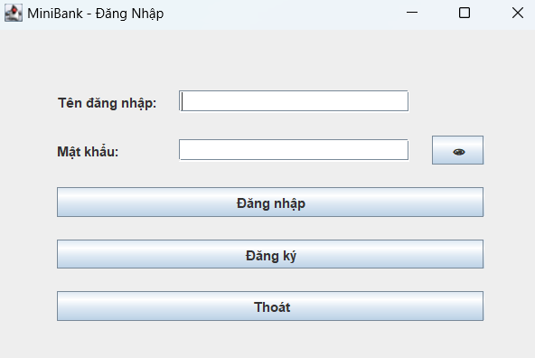
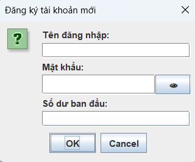
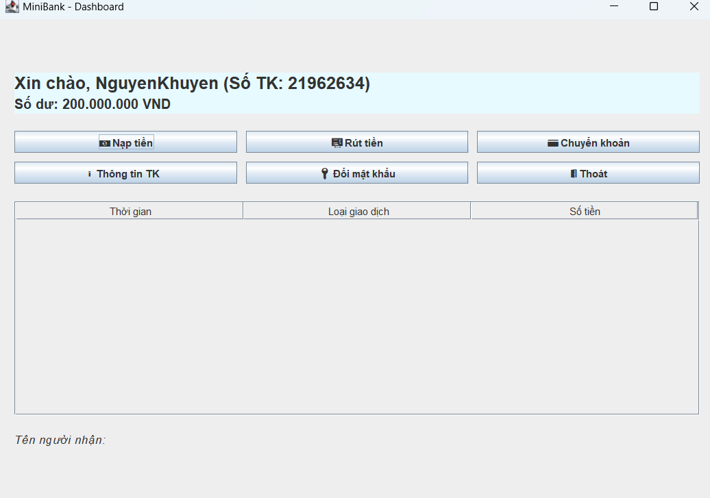
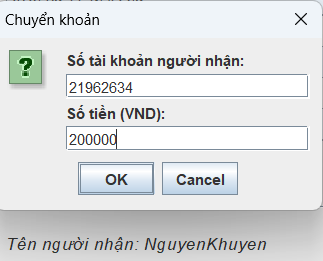
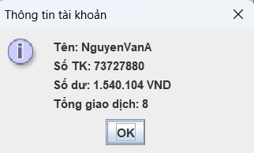
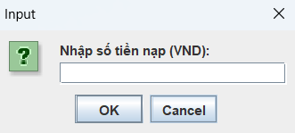

<h2 align="center">
    <a href="https://dainam.edu.vn/vi/khoa-cong-nghe-thong-tin">
    🎓 Faculty of Information Technology (DaiNam University)
    </a>
</h2>
<h2 align="center">
   HỆ THỐNG QUẢN LÝ NGÂN HÀNG MINI
</h2>
<div align="center">
    <p align="center">
        
        
        
    </p>

[](https://www.facebook.com/DNUAIoTLab)
[](https://dainam.edu.vn/vi/khoa-cong-nghe-thong-tin)
[](https://dainam.edu.vn)

</div>

<h2 align="center">
    <a href="https://dainam.edu.vn/vi/khoa-cong-nghe-thong-tin">
    🎓 Faculty of Information Technology (DaiNam University)
    </a>
</h2>
<h2 align="center">
   HỆ THỐNG QUẢN LÝ NGÂN HÀNG MINI
</h2>
<div align="center">
    <p align="center">
        
        
        
    </p>

[](https://www.facebook.com/DNUAIoTLab)
[](https://dainam.edu.vn/vi/khoa-cong-nghe-thong-tin)
[](https://dainam.edu.vn)

</div>

📖 **1. Giới thiệu hệ thống**  

Ứng dụng **MiniBank** được phát triển bằng **Java Swing** cho phép quản lý tài khoản ngân hàng cá nhân với các chức năng cơ bản: **nạp tiền, rút tiền, chuyển khoản, đổi mật khẩu, xem số dư và lịch sử giao dịch**.  

**Các module chính:**  
- `LoginScreen`: đăng nhập/đăng ký  
- `Dashboard`: giao diện chính  
- `AccountInfo`: xử lý dữ liệu tài khoản  
- `Client/Server`: trao đổi và xử lý yêu cầu  

---

🔧 **2. Công nghệ sử dụng**  

- **Java Core**: OOP, Collections  
- **Java Swing**: xây dựng giao diện  
- **Lưu trữ file**: ghi/đọc dữ liệu tài khoản, lịch sử  
- **Hỗ trợ**: `LocalDateTime`, `DecimalFormat`  

---

🚀 **3. Hình ảnh các chức năng**  

<p align="center">
  
  <br>
  <em>Hình 1. Giao diện đăng nhập</em>
</p>

<p align="center">
  
  <br>
  <em>Hình 2. Giao diện đăng ký</em>
</p>

<p align="center">
  
  <br>
  <em>Hình 3. Màn hình chính</em>
</p>

<p align="center">
  
  <br>
  <em>Hình 4. Chuyển khoản</em>
</p>

<p align="center">
  
  <br>
  <em>Hình 5. Thông tin chuyển khoản</em>
</p>

<p align="center">
  
  <br>
  <em>Hình 6. Nạp tiền</em>
</p>

<p align="center">
  
  <br>
  <em>Hình 7. Rút tiền</em>
</p>

---

📝 **4. Cài đặt & Sử dụng**  

**Yêu cầu:** JDK 8+, Windows/macOS/Linux, IDE (Eclipse/IntelliJ/VS Code) hoặc terminal.  

**Cách chạy:**  
```bash
# Biên dịch
javac MiniBank/*.java

# Chạy chương trình
java MiniBank.MainApp
Chức năng chính:

🔑 Đăng nhập / Đăng ký

💵 Nạp tiền | 🏧 Rút tiền | 💳 Chuyển khoản

ℹ️ Xem số dư | 📜 Lịch sử giao dịch

🔑 Đổi mật khẩu | 🚪 Đăng xuất

📝**5. Thông tin liên hệ**

Họ tên: Đỗ Trọng Minh Tiến

Lớp: CNTT 16-03

Email: dotrongminhtien.qc2004@gmail.com

© 2025 AIoTLab, Faculty of Information Technology, DaiNam University. All rights reserved.


