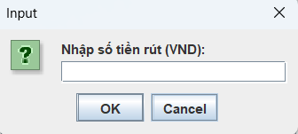

<h2 align="center">
    <a href="https://dainam.edu.vn/vi/khoa-cong-nghe-thong-tin">
    🎓 Faculty of Information Technology (DaiNam University)
    </a>
</h2>
<h2 align="center">
   HỆ THỐNG QUẢN LÝ NGÂN HÀNG MINI
</h2>
<div align="center">
    <p align="center">
        
        
        
    </p>

[](https://www.facebook.com/DNUAIoTLab)
[](https://dainam.edu.vn/vi/khoa-cong-nghe-thong-tin)
[](https://dainam.edu.vn)

</div>

<h2 align="center">
    <a href="https://dainam.edu.vn/vi/khoa-cong-nghe-thong-tin">
    🎓 Faculty of Information Technology (DaiNam University)
    </a>
</h2>
<h2 align="center">
   HỆ THỐNG QUẢN LÝ NGÂN HÀNG MINI
</h2>
<div align="center">
    <p align="center">
        
        
        
    </p>

[](https://www.facebook.com/DNUAIoTLab)
[](https://dainam.edu.vn/vi/khoa-cong-nghe-thong-tin)
[](https://dainam.edu.vn)

</div>

📖 **1. Giới thiệu hệ thống**  

Ứng dụng **MiniBank** được phát triển bằng **Java Swing** cho phép người dùng quản lý tài khoản ngân hàng cá nhân.  
Hệ thống hỗ trợ: **nạp tiền, rút tiền, chuyển khoản, đổi mật khẩu, xem số dư và lịch sử giao dịch**.  

**Các module chính:**  
- **LoginScreen**: đăng nhập/đăng ký.  
- **Dashboard**: quản lý số dư & thao tác giao dịch.  
- **AccountInfo**: xử lý dữ liệu tài khoản, số dư, lịch sử.  
- **Client/Server**: trao đổi dữ liệu và xử lý yêu cầu người dùng.  

---

🔧 **2. Công nghệ sử dụng**  

- **Java Core**: OOP, Collections (`ArrayList`, `HashMap`) để quản lý dữ liệu.  
- **Java Swing**: xây dựng giao diện (`JFrame`, `JTabbedPane`, `JButton`, `JTextField`, …).  
- **Lưu trữ file**: dữ liệu tài khoản và lịch sử được ghi/đọc từ file văn bản.  
- **Hỗ trợ**: `LocalDateTime` cho thời gian giao dịch, `DecimalFormat` để định dạng tiền tệ.  

---

🚀 **3. Hình ảnh các chức năng**  

<p align="center">
  
  <br>
  <em>Hình 1. Giao diện đăng nhập</em>
</p>

<p align="center">
  
  <br>
  <em>Hình 2. Giao diện đăng ký</em>
</p>

<p align="center">
  
  <br>
  <em>Hình 3. Màn hình hiển thị giao diện chính</em>
</p>

<p align="center">
  
  <br>
  <em>Hình 4. Giao diện chuyển khoản</em>
</p>

<p align="center">
  
  <br>
  <em>Hình 5. Giao diện thông tin chuyển khoản</em>
</p>

<p align="center">
  
  <br>
  <em>Hình 6. Giao diện nạp tiền</em>
</p>

<p align="center">
  
  <br>
  <em>Hình 7. Giao diện rút tiền</em>
</p>

---

📝 **4. Hướng dẫn cài đặt và sử dụng**  

**🔧 Yêu cầu hệ thống**  
- **JDK**: 8 trở lên  
- **Hệ điều hành**: Windows / macOS / Linux  
- **IDE**: Eclipse, IntelliJ IDEA, VS Code hoặc terminal  
- **RAM**: ≥ 512MB, Ổ đĩa ≥ 10MB  

**📦 Cài đặt và triển khai**  

- **Bước 1: Kiểm tra Java**  
  ```bash
  java -version
  javac -version
Yêu cầu Java 8+.

Bước 2: Tải mã nguồn
Thư mục MiniBank chứa các file:
MainApp.java, LoginScreen.java, Dashboard.java, AccountInfo.java, ClientMain.java

Bước 3: Biên dịch

bash
Copy code
javac MiniBank/*.java
Bước 4: Chạy ứng dụng

bash
Copy code
java MiniBank.MainApp
Ứng dụng sẽ mở màn hình đăng nhập.

Cách sử dụng:

🔑 Đăng nhập/Đăng ký tài khoản

💵 Nạp tiền | 🏧 Rút tiền | 💳 Chuyển khoản

ℹ️ Xem số dư | 📜 Lịch sử giao dịch

🔑 Đổi mật khẩu | 🚪 Đăng xuất

📝 5. Thông tin liên hệ

Họ tên: Đỗ Trọng Minh Tiến

Lớp: CNTT 16-03

Email: dotrongminhtien.qc2004@gmail.com

© 2025 AIoTLab, Faculty of Information Technology, DaiNam University. All rights reserved.

yaml
Copy code

---

Bạn có muốn mình thêm **sơ đồ kiến trúc (Client ↔ Server ↔ File)** bằng Mermaid diagram vào README đ